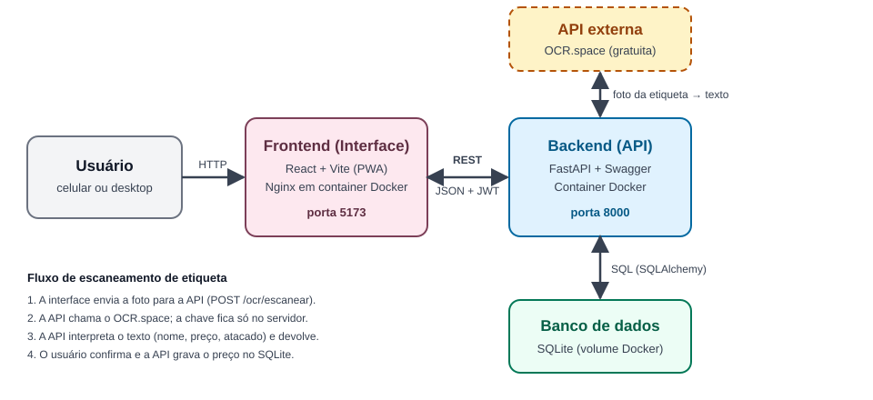

# Confeitaria — Frontend

Interface web mobile-first (PWA) para gestão de compras de uma confeitaria. A pessoa cria listas de compras, tira foto da etiqueta de preço no mercado e o sistema reconhece nome, preço e quantidade mínima (preços de atacado). Um painel compara preços entre fornecedores e mostra a variação ao longo do tempo.

Este repositório é o módulo **"Interface"** (componente principal) do MVP de componentização. A API está no repositório [`mvp-confeitaria-backend`](https://github.com/Arthur5252/mvp-confeitaria-backend). A visão geral do projeto está em [`mvp-confeitaria`](https://github.com/Arthur5252/mvp-confeitaria).

## Sumário

- [Arquitetura](#arquitetura)
- [API externa utilizada](#api-externa-utilizada-ocrspace)
- [Chamadas da interface à API](#chamadas-da-interface-à-api)
- [Funcionalidades](#funcionalidades)
- [Acesso para avaliação](#acesso-para-avaliação)
- [Instalação e execução](#instalação-e-execução)
- [Estrutura de pastas](#estrutura-de-pastas)

## Arquitetura



| Módulo | Papel | Tecnologia | Repositório |
|---|---|---|---|
| **Frontend** (este) | Telas de listas, escaneamento, painel e fornecedores | React + Vite (PWA), servido por Nginx | `mvp-confeitaria-frontend` |
| **Backend** | Regras de negócio, autenticação, banco de dados e integração com o OCR | FastAPI + SQLite | [`mvp-confeitaria-backend`](https://github.com/Arthur5252/mvp-confeitaria-backend) |
| **OCR.space** | Reconhecimento de texto na foto da etiqueta | API REST pública e gratuita (externa) | — |

Estratégia de comunicação:

- O frontend só conversa com o backend, por REST com JSON e token JWT no cabeçalho `Authorization`.
- O backend é quem chama a API externa. Assim a chave do OCR.space não fica exposta no navegador.
- O usuário sempre confirma ou corrige o que foi lido antes de o preço ser salvo.

## API externa utilizada: OCR.space

| Item | Informação |
|---|---|
| Serviço | [OCR.space](https://ocr.space/ocrapi) — reconhecimento de texto (OCR) em imagens |
| Custo | Plano gratuito, sem cartão de crédito. Confira os limites atuais na [página da API](https://ocr.space/ocrapi) |
| Licença | Serviço online proprietário, usado conforme os termos de uso do OCR.space. O projeto não inclui código de terceiros |
| Cadastro | Necessário para uso próprio: chave gratuita em https://ocr.space/ocrapi/freekey, configurada no backend (`CHAVE_API_OCR_SPACE`). O `.env.example` do backend já traz uma chave de avaliação |
| Rota utilizada | `POST https://api.ocr.space/parse/image` |

Parâmetros enviados (multipart/form-data): `file` (a imagem), `apikey`, `language=por`, `OCREngine=2`, `scale=true` e `isTable=false`. Da resposta são usados `ParsedResults[0].ParsedText` (texto reconhecido), `IsErroredOnProcessing` e `ErrorMessage`.

Onde entra no fluxo: na tela **Escanear**, a interface envia a foto para `POST /ocr/escanear` do backend. O backend chama o OCR.space, interpreta o texto e devolve nome, preço, unidade e faixa de atacado sugeridos. Em nenhum momento o usuário é redirecionado para o site do OCR.space. Os detalhes do lado do servidor estão no [README do backend](https://github.com/Arthur5252/mvp-confeitaria-backend#api-externa-utilizada-ocrspace).

## Chamadas da interface à API

A interface usa os quatro tipos de método HTTP. Todas as chamadas, exceto o login, enviam o token JWT. O código está em `src/api/cliente.js`.

| Método | Rota | Onde é usada na interface |
|---|---|---|
| POST | `/autenticacao/entrar` | Tela de login |
| GET | `/listas-compras` e `/listas-compras/{id}` | Listas de compras e detalhe da lista |
| POST | `/listas-compras` | Criar lista |
| POST | `/listas-compras/{id}/itens` | Adicionar item à lista |
| PUT | `/listas-compras/{id}` | Marcar lista como concluída |
| PATCH | `/listas-compras/{id}/itens/{item_id}` | Marcar item como comprado (manual ou após escanear) |
| DELETE | `/listas-compras/{id}/itens/{item_id}` | Remover item da lista |
| GET, POST | `/fornecedores` | Listar e cadastrar fornecedores |
| DELETE | `/fornecedores/{id}` | Remover fornecedor |
| GET, POST | `/produtos` | Sugestões de item e criação de produto |
| POST | `/ocr/escanear` | Enviar a foto da etiqueta |
| POST | `/registros-preco` | Salvar o preço confirmado |
| GET | `/painel/comparacao-precos`, `/painel/historico-precos`, `/painel/destaques` | Gráficos e destaques do painel |

## Funcionalidades

- **Login** simples (usuário único), com token JWT emitido pelo backend.
- **Listas de compras**: criar, listar por data, abrir e marcar itens como comprados.
- **Escanear etiqueta**: tira a foto pela câmera do celular, o backend lê o texto (OCR), a tela mostra nome, preço e quantidade mínima (atacado) para conferir e o item da lista é riscado ao salvar.
- **Fornecedores**: cadastro de mercados e atacadistas.
- **Painel**: comparação de preços entre fornecedores, gráfico de variação no tempo e destaques automáticos.
- **PWA**: instalável na tela inicial do celular.

Stack: React, Vite, React Router, Recharts (gráficos) e `vite-plugin-pwa`.

## Acesso para avaliação

Usuário e senha para entrar na aplicação (já vêm no arquivo `backend/.env.example`):

| Campo | Valor |
|---|---|
| Usuário | `avaliador` |
| Senha | `confeitaria123` |

São credenciais apenas de demonstração. Em uso real, troque `SENHA_APP` e `SEGREDO_JWT` no `.env` por valores próprios.

## Instalação e execução

### Com Docker Compose (frontend + backend juntos)

Requisitos: [Docker Desktop](https://docs.docker.com/desktop/) (no Windows, com WSL2 habilitado) e uma chave gratuita do OCR.space.

1. Clone os dois repositórios como pastas irmãs, **informando o nome da pasta** (o `docker-compose.yml` procura o backend em `../backend`):

   ```bash
   git clone https://github.com/Arthur5252/mvp-confeitaria-backend.git backend
   git clone https://github.com/Arthur5252/mvp-confeitaria-frontend.git frontend
   ```

2. Crie o `.env` do backend:

   ```bash
   cp backend/.env.example backend/.env
   ```

3. Não é preciso editar nada para avaliar: o `backend/.env` já vem com o usuário, a senha e uma chave do OCR.space de avaliação.

4. Suba os containers a partir da pasta do frontend:

   ```bash
   cd frontend
   docker compose up --build
   ```

5. Acesse:

   | O quê | Endereço |
   |---|---|
   | Aplicação | http://localhost:5173 |
   | Swagger da API | http://localhost:8000/docs |

6. Entre com o usuário `avaliador` e a senha `confeitaria123`.

Dados de demonstração (opcional, apaga os dados existentes):

```bash
docker compose exec backend python scripts/popular_demo.py
```

### Sem Docker

Requer Node.js 20+ e o backend rodando (veja o README dele).

```bash
npm install
cp .env.example .env   # ajuste VITE_URL_API se o backend não estiver em localhost:8000
npm run dev
```

A aplicação sobe em `http://localhost:5173`. Para gerar a versão de produção: `npm run build` e `npm run preview`.

## Estrutura de pastas

```text
frontend/
├── src/
│   ├── paginas/        # telas (login, listas, escanear, painel, fornecedores)
│   ├── componentes/    # estrutura da página, navegação, rota protegida
│   ├── contexto/       # estado de autenticação
│   ├── api/cliente.js  # chamadas à API
│   └── index.css       # estilos (mobile-first)
├── docs/arquitetura.svg
├── Dockerfile
├── docker-compose.yml  # sobe frontend + backend
├── nginx.conf
└── vite.config.js
```
