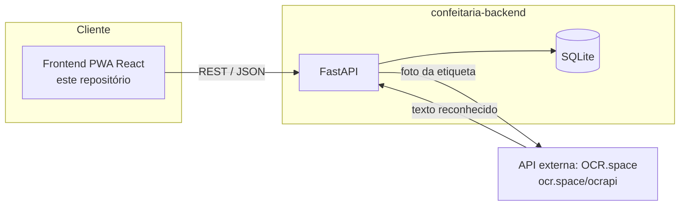

# Confeitaria — Frontend

Interface web mobile-first (PWA) para gestão de compras de uma confeitaria: criação de listas de compras, leitura automática de etiquetas de mercado via foto (OCR), comparação de preços entre fornecedores e dashboard de variação de preços ao longo do tempo.

Este repositório é o módulo **"Interface"** do MVP de componentização/microsserviços. O módulo de API está no repositório [`confeitaria-backend`](https://github.com/SEU_USUARIO/confeitaria-backend).

## Arquitetura



O frontend consome exclusivamente a API própria (`confeitaria-backend`), que por sua vez orquestra a chamada à API externa de OCR — isso evita expor a chave da API externa no navegador do usuário. Detalhes da API externa (licença, cadastro, rota utilizada) estão documentados no [README do backend](https://github.com/SEU_USUARIO/confeitaria-backend#api-externa-utilizada-ocrspace).

## Funcionalidades

- **Login** simples (single-user), token JWT emitido pelo backend.
- **Listas de compras**: criar, listar por data, abrir, marcar itens como comprados.
- **Escanear etiqueta**: tira foto pela câmera do celular → backend lê o texto (OCR) → tela de confirmação/edição do nome, preço e quantidade mínima (para preços de atacado) → salva o registro de preço e risca o item da lista.
- **Fornecedores**: cadastro simples de mercados/atacadistas.
- **Dashboard**: comparação de preços entre fornecedores para um produto e gráfico de variação de preço ao longo do tempo, além de insights automáticos.
- **PWA**: instalável na tela inicial do celular para acesso rápido à câmera no mercado.

## Stack

React + Vite, React Router, Recharts (gráficos), `vite-plugin-pwa`.

## Instalação e execução local (sem Docker)

Requer Node.js 20+.

```bash
npm install
cp .env.example .env   # ajuste VITE_API_URL se o backend não estiver em localhost:8000
npm run dev
```

A aplicação sobe em `http://localhost:5173`. É necessário que o [`confeitaria-backend`](https://github.com/SEU_USUARIO/confeitaria-backend) esteja rodando (veja o README dele).

## Execução com Docker Compose (frontend + backend juntos)

Clone os dois repositórios como pastas irmãs e rode a partir daqui:

```bash
docker compose up --build
```

- Frontend: `http://localhost:5173`
- Backend/Swagger: `http://localhost:8000/docs`

## Build de produção

```bash
npm run build
npm run preview
```
